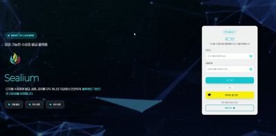

# Sealium  

  

---

>> **DID(Decentralized Identifier)** 기반으로 안전하고 투명한 **VC(Verifiable Credential)** 발급 및 검증을 지원하는 **반응형 웹 플랫폼**

## 배포 주소  
[https://sealiumback.store](https://sealiumback.store)  

---

## 목차
- [프로젝트 소개](#프로젝트-소개)
- [화면 구성](#화면-구성)
- [주요 기능 (Frontend)](#주요-기능-frontend)
- [담당 기능](#담당-기능)
- [개발 기간](#개발-기간)
- [팀원소개](#팀원소개)
- [기술 스택](#기술-스택)
- [협업 도구](#협업-도구)
- [배포 과정](#배포-과정)
- [이슈 상황](#이슈-상황)
- [해결 방안](#해결-방안)
- [개선 방향](#개선-방향)
- [향후 확장 방향](#향후-확장-방향)
- [느낀 점](#느낀-점)

---

## 프로젝트 소개
**Sealium**은 분산 신원 기술(DID)을 기반으로, 사용자가 **안전하게 자격 증명(VC)** 을 발급, 관리, 공유할 수 있도록 하는 플랫폼입니다.  

---

## 화면 구성  

### 계정 및 인증  
- **일반 계정 회원가입 페이지**  
    

- **일반 계정 로그인 페이지**  
    

- **카카오 로그인 후 DID 추가정보 입력 페이지**  
    

---

### 인트로 & 대시보드  
- **인트로 페이지**  
    

- **대시보드 페이지**  
    

---

### VC 관련 기능  
- **VC 발급 요청 페이지**  
    

- **VC 요청 현황 페이지**  
    

- **VC 목록 페이지**  
    

- **VC 상세 페이지**  
    

- **VC 공유 링크 생성 페이지**  
    

- **VC 폐기 요청 페이지**  
    

---

### 회원 관리  
- **내 정보 페이지**  
   

- **회원 정보 수정 페이지**  
    

---

## 주요 기능 (Frontend)

- 회원가입 시 스마트 컨트랙트를 통해 DID 자동 생성 및 등록  
- VC 발급, 검증, 폐기 및 상세 조회 기능 제공  
- VC 공유 링크 생성 및 관리 기능  
- 일반 계정 회원가입/로그인 및 카카오 로그인 연동  
- 내 정보 조회 및 회원 정보 수정/탈퇴 기능  
- 반응형 UI 지원으로 다양한 디바이스 환경 최적화  

---

## 담당 기능 (이수호 - Frontend)

### DID 지갑 관리
- 회원가입 시 스마트 컨트랙트를 통해 DID 자동 생성 및 등록되는 프로세스 UI 구현  
- DID 데이터 표시 및 조회 화면 개발  
- 반응형 레이아웃 적용으로 다양한 디바이스에서 최적화된 UI 제공  

### VC 발급 및 관리
- VC 발급/폐기 요청 처리 결과를 시각적으로 표시하는 UI 개발  
- 발급된 VC 목록 및 상세 조회 화면 구현  
- VC 상태(유효/폐기 등) 관리 및 사용자 경험 개선  

### 전역 상태 및 서버 상태 관리
- **React Query**를 활용해 서버 데이터 캐싱 및 비동기 통신 최적화  
- **Zustand**를 사용해 사용자 정보 및 인증 상태를 전역에서 관리  
- 서버 상태와 클라이언트 전역 상태를 명확히 분리해 안정적인 상태 관리 구조 설계  

---

## 개발 기간
2025.08.04 ~ 2025.09.17  

---

## 팀원소개
| 팀원 | 역할 | GitHub |
|------|------|--------|
|  | 이수호 – 프론트엔드 개발 (VC 발급/폐기 UI, VC 목록,상세 조회, 상태 관리, 배포) | [@susuholee](https://github.com/susuholee) |
|  | 비노드 – 백엔드 개발 (API, 블록체인, 배포) & 프론트엔드 일부 (DID 생성·등록, VC 검증 페이지, 관리자 페이지) | [@Mr-Binod](https://github.com/Mr-Binod) |
|  | 구다경 – 초기 UI 참여, 이후 중도 이탈 | [@kooming](https://github.com/kooming) |

---

## 기술 스택 (Frontend)
  
 
      
     
      
      
  
  

---

## 배포 과정
- **Frontend**: AWS S3 + CloudFront를 활용해 정적 파일을 호스팅 및 CDN 배포  
- **특징**: HTTPS 적용 및 캐싱 최적화를 통해 안정적인 서비스 환경 제공  

---
## 협업 도구
 

---

## 이슈 상황

| 번호 | 이슈 내용 |
|------|-----------|
| 1 | 프로젝트 중도에 팀원이 이탈하여 역할 공백 발생|
| 2 | 카카오 로그인 이후 리다이렉트 시 메인 페이지가 반복 렌더링되는 현상 |
---

## 해결 방안

| 문제 | 해결 방법 | 
|------|-----------| 
| 팀원 이탈로 인한 역할 공백 | 남은 팀원이 역할을 재분배하고, 우선순위를 조정해 핵심 기능(VC 발급, 검증 등)에 집중 → 프로젝트를 마감 기한 내에 완성 |
| 카카오 로그인 redirect 무한 렌더링 | 리다이렉트 로직을 전역 레이아웃으로 이동하고, 조건 분기 처리로 무한 렌더링 방지 |

---

## 개선 방향

| 항목 | 개선 방향 | 기대 효과 |
|------|------------|------------|
| 코드 구조 | 컴포넌트 모듈화 및 리팩토링 | 유지보수성 강화 |
| 데이터 최신화 | 수동 새로고침(refetch) 외에 캐싱 무효화 및 자동 백그라운드 refetch 도입 | 사용자에게 최신 데이터 즉시 제공 |
| 공유 링크 구조 | userId/certificateName 기반 → certificateId 기반으로 개선 | 보안 강화 및 URL 안정성 확보 |
| 에러 처리 | 전역 에러 핸들링 및 사용자 친화적 메시지 제공 | 서비스 신뢰도 향상 |

---

## 향후 확장 방향

| 항목 | 확장 방향 | 기대 효과 |
|------|-----------|-----------|
| 다국어 지원 | 글로벌 사용자 대상 UI 번역 지원 | 접근성 확대 |
| 생체 인증 연동 | DID 지갑 접근 시 지문/Face ID 적용 | 보안 강화 |
| 실시간 알림 | VC 발급/검증 시 알림 제공 | 사용자 경험 개선 |

---

## 느낀 점

이번 프로젝트를 통해 단순히 기능 구현을 넘어, 실제 서비스에 가까운 VC 발급 플랫폼을 설계하고 최적화하는 경험을 할 수 있었습니다.
특히 Next.js를 활용하면서 SSR/CSR 구조에 대한 이해를 넓혔고, 더 나은 사용자 경험을 위해 어떤 선택을 해야 하는지 고민할 수 있었습니다.

또한 상태 관리에서는 React Query와 Zustand를 병행하며, 서버 상태와 전역 상태를 어떻게 구분하고 관리해야 하는지 깊이 배우게 되었습니다.
Redux와 달리 간결한 패턴을 가진 Zustand를 활용하면서 "꼭 복잡한 도구가 아니더라도 상황에 맞는 해법이 있다"는 점을 체감했습니다.

무엇보다 협업 과정에서 GitHub, Notion을 적극적으로 활용하면서, 실무와 유사한 협업 워크플로우를 경험할 수 있었고,
프론트엔드 담당으로 맡은 역할을 끝까지 책임지며 프로젝트를 완성한 과정에서 큰 성취감과 성장을 느낄 수 있었습니다.
이번 경험을 바탕으로 앞으로도 더 안정적이고 사용자 친화적인 서비스를 만들어 나가고 싶습니다.
